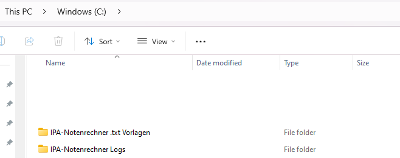
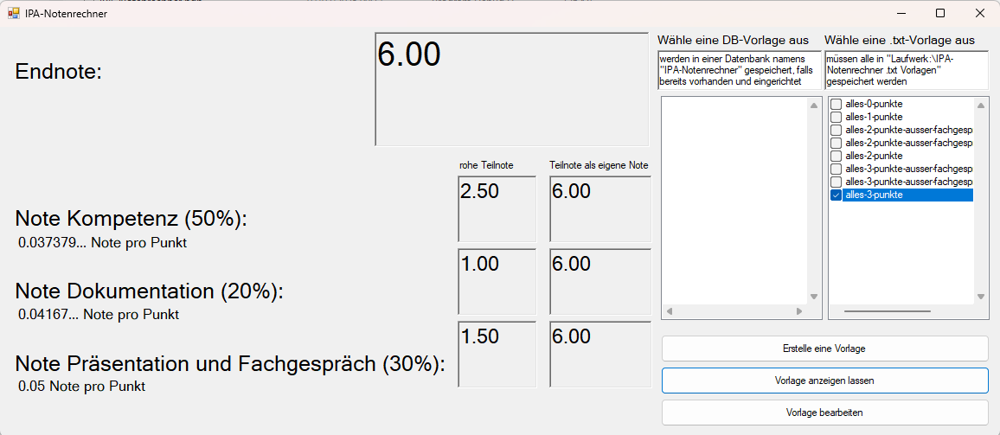
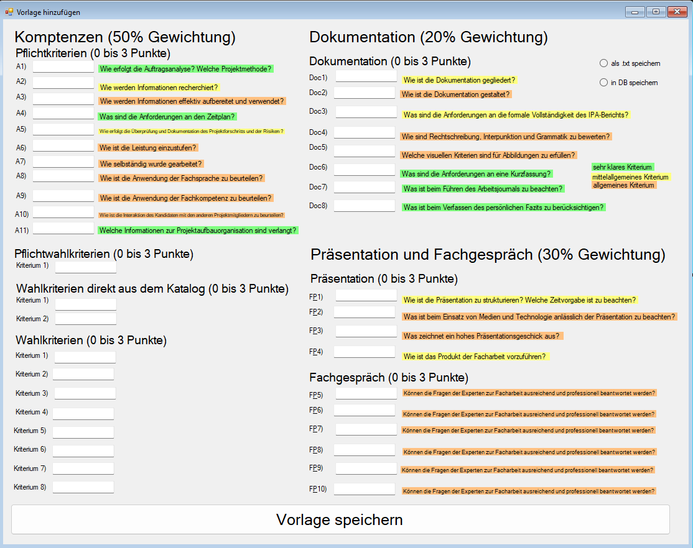
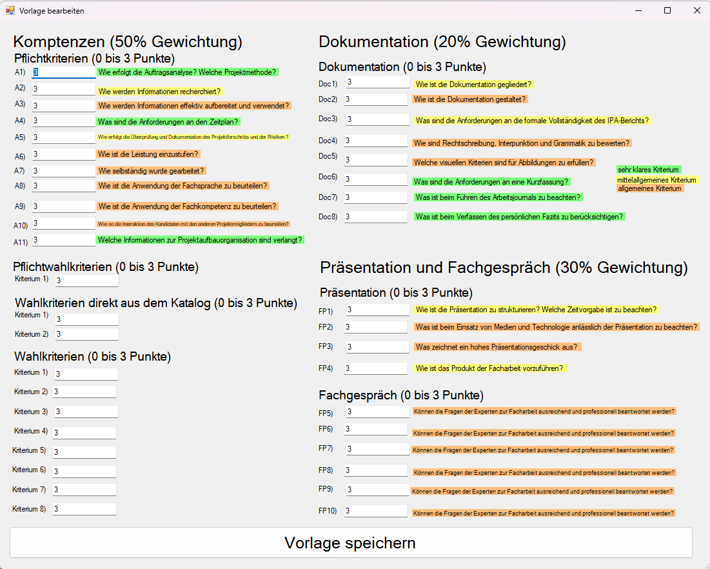

# IPA-Notenrechner

Windows Forms Anwendung zur Berechnung und Verwaltung von IPA-Noten.

## Features

- Notenberechnung mit konfigurierbaren Gewichtungen (50%, 20%, 30%)
- Vorlagen als .txt-Datei oder in SQL-Datenbank speichern
- Bearbeiten bestehender Vorlagen
- Automatische Berechnung der Teilnoten und Endnote

## Installation

1. Repository klonen
2. In Visual Studio öffnen und kompilieren
3. Anwendung starten - erforderliche Ordner werden automatisch erstellt

## Ordnerstruktur

Die Anwendung erstellt automatisch folgende Ordner:

## Hauptfenster

Das Hauptfenster zeigt die berechnete Endnote und Teilnoten an:

## Vorlagen erstellen

Neue Bewertungsvorlagen können über ein Formular erstellt werden:

## Vorlagen bearbeiten

Bestehende Vorlagen können bearbeitet werden:

## Technische Details

- .NET Framework 4.8
- Windows Forms
- SQL Server für optionale DB-Anbindung
- Speicherung als .txt Dateien oder in SQL DB

## Hinweis zur Datenbank

Die DB-Funktionalität erfordert:
- SQL Server Express/Developer Edition
- Installierte Datenbank "IPA-Notenrechner"
- Korrekte Connection Strings in App.config